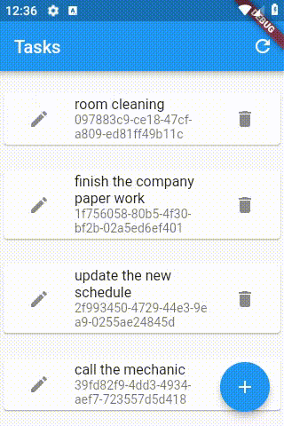

# e004_flutter_listview_crud_app_using_nonsecure_rest_api

## Screen Record

## What

- flutter Task app using non-secure rest api

- must run with :

  - [elrashid-flutter-examples/e002-aspcore-rest-api-server-for-flutter](https://github.com/elrashid-flutter-examples/e002-aspcore-rest-api-server-for-flutter)

## Step 1

add the flowing dependencies to pubspec.yaml

      http: any

## Step 2 - Task Object

Task Object to communicate with server

    class TaskOpj {
    String guid;
    String note;
    String createdAt;
    String modfiledAt;

    TaskOpj({this.guid, this.note, this.createdAt, this.modfiledAt});

    TaskOpj.fromJson(Map<String, dynamic> json) {
        guid = json['guid'];
        note = json['note'];
        createdAt = json['createdAt'];
        modfiledAt = json['modfiledAt'];
    }

    Map<String, dynamic> toJson() {
        final Map<String, dynamic> data = new Map<String, dynamic>();
        data['guid'] = this.guid;
        data['note'] = this.note;
        data['createdAt'] = this.createdAt;
        data['modfiledAt'] = this.modfiledAt;
        return data;
    }
    }

## Step 3 - REST API Call

code to communicate with server

    class Tasks {
    static String apiEndpoint = "http://10.0.2.2:5011/api/Task/";

    static Future<List<TaskOpj>> allTasks() async {
        var response =
            await http.get(apiEndpoint, headers: await _getDefaultHeader());

        if (response.statusCode == 200) {
        final responseJson = json.decode(response.body);
        var list = new List<TaskOpj>();
        responseJson
            .forEach((element) => list.add(new TaskOpj.fromJson(element)));
        return list;
        } else {
        throw Exception('Failed to get Tasks');
        }
    }

    static Future<TaskOpj> getTask(String id) async {
        var response =
            await http.get(apiEndpoint + id, headers: await _getDefaultHeader());
        if (response.statusCode == 200) {
        final responseJson = json.decode(response.body);
        var opj = TaskOpj.fromJson(responseJson);
        return opj;
        } else {
        throw Exception('Failed to get Task with id = $id');
        }
    }

    static Future<TaskOpj> createTask(TaskOpj opj) async {
        var body = json.encode(opj);
        var response = await http.post(apiEndpoint,
            body: body, headers: await _getDefaultHeader());
        if (response.statusCode == 201) {
        final responseJson = json.decode(response.body);
        var opj = TaskOpj.fromJson(responseJson);
        return opj;
        } else {
        throw Exception('Failed to create Task \n $body');
        }
    }

    static Future<bool> updateTask(TaskOpj opj) async {
        var body = json.encode(opj);
        var response = await http.put(apiEndpoint + opj.guid,
            body: body, headers: await _getDefaultHeader());
        if (response.statusCode == 204) {
        return true;
        } else {
        throw Exception('Failed to update Task \n $body');
        }
    }

    static Future deleteTask(String id) async {
        var response =
            await http.delete(apiEndpoint + id, headers: await _getDefaultHeader());
        if (response.statusCode == 204) {
        return;
        } else {
        throw Exception('Failed to delete Task with id = $id');
        }
    }

    static Future<Map<String, String>> _getDefaultHeader(
        [Map<String, String> curentHeaders]) async {
        var headers = Map<String, String>();
    
        var jsonHeader = "application/json";
        headers['content-type'] = jsonHeader;
        if (curentHeaders != null) {
        curentHeaders.forEach((key, value) {
            headers[key] = value;
        });
        }

        return headers;
    }
    }

## Step 4 - TasksPageWidget

    class TasksPageWidget extends StatefulWidget {
    @override
    _TasksPageWidgetState createState() => _TasksPageWidgetState();
    }

    class _TasksPageWidgetState extends State<TasksPageWidget> {
    @override
    void initState() {
        super.initState();
        refresh();
    }

    Future refresh() async {
        tasks = await Tasks.allTasks();
        setState(() {});
    }

    var tasks = List<TaskOpj>();

    @override
    Widget build(BuildContext context) {
        return Scaffold(
        appBar: AppBar(
            title: Text("Tasks"),
            actions: <Widget>[
            IconButton(
                icon: Icon(Icons.refresh),
                onPressed: () => refresh(),
            ),
            ],
        ),
        body: ListView.builder(
            itemCount: tasks.length,
            itemBuilder: (context, index) => TaskWidget(
            taskOpj: tasks[index],
            notifyParent: refresh,
            ),
        ),
        floatingActionButton: FloatingActionButton(
            onPressed: () => Navigator.push(
            context,
            MaterialPageRoute(
                builder: (context) {
                return TaskAddPageWidget(
                    notifyParent: refresh,
                );
                },
            ),
            ),
            tooltip: 'add',
            child: Icon(Icons.add),
        ),
        );
    }
    }

## Step 5 - TaskWidget

    class TaskWidget extends StatelessWidget {
    final TaskOpj taskOpj;
    final Function() notifyParent;
    TaskWidget({Key key, @required this.taskOpj, @required this.notifyParent})
        : super(key: key);

    @override
    Widget build(BuildContext context) {
        return Padding(
        padding: const EdgeInsets.only(
            top: 20.0,
            bottom: 0.0,
        ),
        child: new Card(
            child: ListTile(
            leading: IconButton(
                icon: Icon(Icons.edit),
                onPressed: () => Navigator.push(
                context,
                MaterialPageRoute(
                    builder: (context) {
                    return TaskEditPageWidget(
                        taskOpj: taskOpj,
                        notifyParent: notifyParent,
                    );
                    },
                ),
                ),
            ),
            title: Text(taskOpj.note),
            subtitle: Text(taskOpj.guid),
            trailing: new IconButton(
                icon: Icon(Icons.delete),
                onPressed: () async {
                await Tasks.deleteTask(taskOpj.guid);
                Scaffold.of(context).hideCurrentSnackBar();
                Scaffold.of(context).showSnackBar(new SnackBar(
                    content: new Text("Deleted note : " + taskOpj.guid),
                ));
                if (notifyParent != null) notifyParent();
                },
            ),
            ),
        ),
        );
    }
    }

## Step 6 - TaskEditPageWidget

    class TaskEditPageWidget extends StatefulWidget {
    final Function() notifyParent;
    final TaskOpj taskOpj;
    TaskEditPageWidget(
        {Key key, @required this.taskOpj, @required this.notifyParent})
        : super(key: key);

    @override
    _TaskEditPageWidgetState createState() => _TaskEditPageWidgetState();
    }

    class _TaskEditPageWidgetState extends State<TaskEditPageWidget> {
    TextEditingController _noteController;

    @override
    void initState() {
        super.initState();
        _noteController = TextEditingController.fromValue(
        TextEditingValue(
            text: widget.taskOpj.note,
        ),
        );
    }

    @override
    void dispose() {
        _noteController.dispose();
        super.dispose();
    }

    @override
    Widget build(BuildContext context) {
        return Scaffold(
        appBar: _appBar(),
        body: _body(),
        );
    }

    Widget _appBar() {
        return AppBar(
        title: new Text("Edit Task"),
        actions: <Widget>[
            new IconButton(
            icon: new Icon(Icons.save),
            onPressed: _save,
            ),
        ],
        );
    }

    Widget _body() {
        return SingleChildScrollView(
        child: Column(
            children: <Widget>[
            Text("Note:"),
            TextField(
                decoration: InputDecoration(border: InputBorder.none),
                autofocus: true,
                keyboardType: TextInputType.multiline,
                maxLines: null,
                controller: _noteController),
            ],
        ),
        );
    }

    Future _save() async {
        widget.taskOpj.note = _noteController.text;
        await Tasks.updateTask(widget.taskOpj);
        widget.notifyParent();
        Navigator.pop(context);
    }
    }

## Step 7 - TaskAddPageWidget

    class TaskAddPageWidget extends StatefulWidget {
    final Function() notifyParent;
    TaskAddPageWidget({Key key, @required this.notifyParent}) : super(key: key);
    @override
    _TaskAddPageWidgetState createState() => _TaskAddPageWidgetState();
    }

    class _TaskAddPageWidgetState extends State<TaskAddPageWidget> {
    TextEditingController _noteController;

    @override
    void initState() {
        super.initState();
        _noteController = TextEditingController();
    }

    @override
    void dispose() {
        _noteController.dispose();
        super.dispose();
    }

    @override
    Widget build(BuildContext context) {
        return Scaffold(
        appBar: _appBar(),
        body: _body(),
        );
    }

    Widget _appBar() {
        return AppBar(
        title: new Text("Add Task"),
        actions: <Widget>[
            new IconButton(
            icon: new Icon(Icons.save),
            onPressed: _save,
            ),
        ],
        );
    }

    Widget _body() {
        return SingleChildScrollView(
        child: Column(
            children: <Widget>[
            Text("Note:"),
            TextField(
                decoration: InputDecoration(border: InputBorder.none),
                autofocus: true,
                keyboardType: TextInputType.multiline,
                maxLines: null,
                controller: _noteController),
            ],
        ),
        );
    }

    Future _save() async {
        var taskOpj = TaskOpj();
        taskOpj.note = _noteController.text;
        await Tasks.createTask(taskOpj);
        widget.notifyParent();
        Navigator.pop(context);
    }
    }

## Step 8 - main

    void main() {
    runApp(MyApp());
    }

    class MyApp extends StatelessWidget {
    Widget build(BuildContext context) {
        var materialApp = MaterialApp(
        title: 'MY APP',
        theme: ThemeData(
            primarySwatch: Colors.blue,
        ),
        home: TasksPageWidget(),
        );
        return materialApp;
    }
    }

## Note

- when importing http use as

        import 'package:http/http.dart' as http;

- when using hot reload use it twice , because sometimes the code does not refresh
